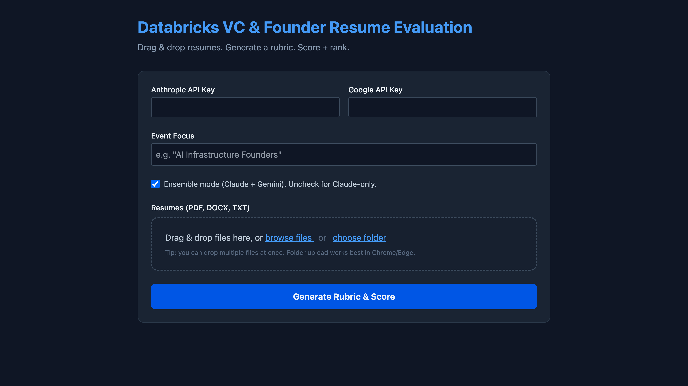

# Databricks VC & Founder Resume Evaluation Tool

> Drag & drop resumes. Generate a rubric. Score + rank.

A lightweight agentic resume evaluation system for VC dinners, founder roundtables, and high-signal candidate selection events.

---

## Key Clarification: Railway Dependency

**This tool is not dependent on Railway.** It is a standard Flask web app with a static HTML frontend and a single processing endpoint. For demonstration purposes we chose to host the tool on Railway, but it runs identically on alternate hosts such as Render, a bare VM, a local machine, or any Python-compatible host.

The backend uses a temporary writable directory per run and exposes download routes for generated artifacts. There is no Railway-specific API or runtime dependency in the codebase.

**Hosting options:**

- **Default:** Use the hosted instance at `vcdinnertool-production.up.railway.app` — no setup required, just prepare your own API keys.
- **Self-host:** Fork the repo and deploy your own instance (see [Self-Hosting](#self-hosting) below). Recommended for users who want full control over uptime, data handling, and or compute cost.

---

## What This Tool Does

Instead of manually scanning a folder of resumes, this tool:

1. Accepts a batch of uploaded resumes (PDF, DOCX, or TXT)
2. Reads the candidate pool and samples it for context
3. Generates a custom evaluation rubric tailored to a user-specified event focus
4. Scores each candidate against that rubric with one or two LLMs (Gemini, Claude)
5. Ranks candidates by a weighted composite score (Currently weighted 60% Crackedness, 40% Fit)
6. Returns outputs in downloadable format (i.e. a rubric JSON, an Excel rankings spreadsheet, and per-candidate score detail files)

**Typical use cases:**

- VC dinners and invite-only networking events
- Demo day candidate triage
- Internal candidate ranking before partner discussion

---

## Expected Runtime

For a typical batch of resumes, expect roughly **10–15 minutes** end-to-end, especially in ensemble mode. Ensemble mode uses both Claude and Gemini to score resumes, averaging the results for improved robustness (slower runtimes and higher token cost).

Runtime may depend on:
- Resume Batch Size
- Resume length
- Ensemble mode Used (Claude + Gemini)

Claude-only mode is meaningfully faster. Ensemble mode is slower but generally more robust, since two independent models must agree on a rubric and scores before a final ranking is produced.

Results print to the browser once processing is complete.

---

## Architecture

```
Upload resumes
      │
      ▼
Parse text (PDF / DOCX / TXT)
      │
      ▼
Create resume pool summary (first 300 chars of up to 10 resumes)
      │
      ▼
Generate rubric
  ├── Claude generates crackedness + fit rubric
  ├── Gemini generates crackedness + fit rubric
  └── Claude synthesizes both into a final merged rubric
      (falls back to whichever model succeeded if one fails)
      │
      ▼
Score each resume
  ├── Claude scores the resume against the rubric
  ├── (Ensemble only) Gemini scores the same resume
  └── Scores are averaged: crackedness avg, fit avg
      │
      ▼
Rank candidates
  └── Composite = (0.6 × Crackedness) + (0.4 × Fit)
      │
      ▼
Output
  ├── candidate_rankings.xlsx
  ├── rubric.json
  └── rubric_scores.zip (per-candidate JSON detail files)
```

Each run gets an isolated temporary directory on the server (`/tmp/runs/<run_id>/`). Artifacts are served at `/downloads/<run_id>/<filename>` and are available for the duration of the server session.

---

## Scoring Methodology

### Two Dimensions

Every candidate is evaluated on two independent dimensions.

**Crackedness (0–100 points)**
Measures overall talent, achievement signal, and potential — how impressive the candidate is independent of the specific event theme. This captures raw capability, trajectory, and résumé signal strength.

**Fit (0–100 points)**
Measures alignment with the specific event focus. A great candidate who is completely irrelevant to the dinner theme will score high on Crackedness and low on Fit. A niche operator perfectly suited to the event will score the reverse.

### Rubric Structure

Each dimension is broken into 5–7 criteria. Each criterion has:
- A name and description
- A point allocation (all criteria within a dimension sum to 100)
- A scoring guide with "high," "medium," and "low" bands

The rubric is dynamic and generated fresh for every run based on: 
- The event focus prompt you provide
- A sample of the actual resume pool being evaluated

This allows for selection criteria to be industry or task specific. 

### Scoring Precision

The scorer explicitly instructs the model to:
- Use decimal precision (e.g., 14.7, not 15.0)
- Reserve top scores for rare, exceptional candidates
- Justify each score with specific resume evidence

This creates meaningful separation within a competitive batch rather than a flat distribution near the top.

### Composite Ranking

```
Composite Score = (0.6 × Crackedness) + (0.4 × Fit)
```

Crackedness is weighted more heavily by default, reflecting the view that raw talent matters more than perfect event fit. This 60/40 weighting is hardcoded in the current version.

---

## User Interface



The interface is a single-page browser app with the following fields:

| Field | Description |
|---|---|
| Anthropic API Key | Your `sk-ant-...` key from console.anthropic.com |
| Google API Key | Your Gemini key from aistudio.google.com |
| Event Focus | Free-text prompt describing the dinner theme |
| Ensemble Mode | Checkbox indicating preference for ensemble mode |
| Resumes | Drag & drop, browse files, or choose folder (PDF, DOCX, TXT) |

---

## Step-by-Step Workflow

**Step 1.** Open the app.

**Step 2.** Paste your Anthropic API key and Google API key into the fields. You are responsible for supplying your own keys (see [API Key Handling](#api-key-handling)).

**Step 3.** Enter an event focus prompt. Be specific — the rubric quality depends directly on the clarity of your prompt.

Good examples:
- `Healthcare founders at seed or Series A with clinical or ops background`
- `Founding engineers with startup and product design experience`
- `Enterprise data infra operators relevant to the Databricks ecosystem`
- `Hard tech founders with PhDs or research backgrounds`

Vague examples to avoid:
- `Founders`
- `Good candidates`
- `VC People for the dinner`

**Step 4.** Upload resumes. You can drag and drop multiple files, use the file browser, or select an entire folder. Folder upload works best in Chrome or Edge.

**Step 5.** Choose ensemble mode or Claude-only. Ensemble is recommended for final review batches. Claude-only is faster for iteration.

**Step 6.** Click **Generate Rubric & Score**.

**Step 7.** Wait. Processing typically takes ~15-20 minutes for a medium batch.

**Step 8.** Review results in the browser and download the artifacts.

---

## API Key Handling

Users supply their own API keys. The backend temporarily sets environment variables for the duration of each request, instantiates the model clients, and restores the previous environment in a `finally` block.

Keys are not logged or persisted in application output.

### Keys source:

| Provider | URL |
|---|---|
| Anthropic (Claude) | https://console.anthropic.com |
| Google (Gemini) | https://aistudio.google.com/app/apikey |

---

## Supported File Types

| Format | Parser |
|---|---|
| `.pdf` | PyPDF2 |
| `.docx` | python-docx |
| `.txt` | Standard UTF-8 read |

Current maximum upload size per request: **250 MB total**. Set in app.py

Resume quality affects output quality. Scanned PDFs with poor OCR, sparse résumés, and heavily formatted documents (tables, columns, graphics) may not parse cleanly, which can reduce scoring accuracy.

---

## Output Files

### `candidate_rankings.xlsx`
An Excel spreadsheet with one row per candidate, columns:

| Column | Description |
|---|---|
| Rank | Composite ranking position |
| Candidate | Resume filename |
| Composite Score | Weighted composite (0–100) |
| Crackedness Score | Raw crackedness total (0–100) |
| Fit Score | Raw fit total (0–100) |
| Description | One-paragraph candidate summary |
| Why Selected / Notable | Strengths and notable signals from the resume |

### `rubric.json`
Machine-readable JSON containing the full rubric used for this run:
- All crackedness and fit criteria
- Point allocations per criterion
- Scoring guides (high / medium / low bands)
- Metadata (focus area, creation date, whether ensemble or single model)

This file can be inspected to understand what the models were optimized for, or saved for reuse in future scoring runs.

### `rubric_scores.zip`
A zip archive containing one JSON file per candidate with:
- Per-criterion scores (points awarded, max points, percentage, evidence)
- Total crackedness and fit scores
- Candidate description and strengths explanation
- Raw model outputs from each LLM (in ensemble mode)

---

## Tech Stack

**Backend**

| Package | Purpose |
|---|---|
| Flask | Web server and routing |
| Werkzeug | File upload handling |
| Anthropic SDK | Claude API access |
| google-generativeai | Gemini API access |
| PyPDF2 | PDF text extraction |
| python-docx | DOCX text extraction |
| openpyxl | Excel spreadsheet generation |
| pandas | Tabular data handling |

**Frontend**
- Static HTML served by Flask
- Tailwind CSS via CDN
- Vanilla JavaScript fetch for upload and results display

**Models**
- Rubric generation: `claude-sonnet-4-20250514` (synthesis) and `gemini-2.0-flash-exp`
- Resume scoring: `claude-sonnet-4-6` and `gemini-2.0-flash-exp`

---

## Self-Hosting

### Option A: Run locally

**1. Clone the repo**
```bash
git clone <your-repo-url>
cd VC_Dinner_Tool
```

**2. Create a virtual environment**
```bash
python -m venv .venv
source .venv/bin/activate   # On Windows: .venv\Scripts\activate
```

**3. Install dependencies**
```bash
pip install -r requirements.txt
```

**4. Run the app**
```bash
python app.py
```

This starts the Flask server on port 5001. Open `http://localhost:5001` in your browser.

### Option B: Deploy to Railway

1. Fork or clone this repository to your GitHub account
2. Go to [railway.app](https://railway.app) and create a new project
3. Select "Deploy from GitHub repo" and connect your fork
4. Set the start command to:
   ```
   gunicorn app:app --bind 0.0.0.0:$PORT
   ```
5. Deploy

If you use gunicorn, add it to `requirements.txt`.

### Option C: Deploy to Render

1. Fork the repository
2. Create a new Web Service on [render.com](https://render.com)
3. Connect your GitHub repo
4. Set build command: `pip install -r requirements.txt`
5. Set start command: `gunicorn app:app --bind 0.0.0.0:$PORT`
6. Deploy

---

## Repository Structure

```
VC_Dinner_Tool/
├── app.py               # Flask backend — routes, orchestration, file handling
├── index.html           # Single-page frontend UI
├── create_rubric.py     # Rubric generation pipeline (Claude + Gemini ensemble)
├── score_resumes.py     # Resume scoring, ranking, spreadsheet + JSON output
├── requirements.txt     # Python dependencies
└── index.py             # Vercel/gunicorn entrypoint (imports app from app.py)
```

### Environment notes

The app reads `ANTHROPIC_API_KEY` and `GOOGLE_API_KEY` from environment variables at request time. In the current web UI flow, users paste keys into the form — the app does not require them to be set as server environment variables. If you want to hardcode a shared key for a private deployment, you can set these as environment variables in your hosting provider's dashboard instead of collecting them from the form.

---

## Limitations

This tool is designed to provide a recommendation pipeline to accelerate candidate review, not replace judgment. This tool has not been rigorously evaluated by a statistician. 

**LLM scoring is imperfect.** Rubric generation and scoring are model-generated and can vary between runs. The ensemble mode reduces variance but does not eliminate it.

**Resume quality affects output.** Scanned PDFs, poorly structured documents, or resumes with heavy graphic design may not parse cleanly. Garbage in, garbage out.

**The rubric is only as good as the prompt.** A vague event focus produces a generic rubric that does not differentiate well. Invest thirty seconds in writing a specific prompt.

**Ensemble mode is slower and more expensive.** Two models, twice the API cost, meaningfully more wall-clock time.

**Ranking weights are fixed.** The 60/40 Crackedness/Fit split is hardcoded. If your event prioritizes Fit more heavily, that isn't currently configurable in the UI. Code must be changed. 

**This is a triage tool, not a decision engine.** Use the output to prioritize your manual review, not to replace it. The final selection should involve a human reviewing the top-ranked candidates directly.

---

## Best Practices

- Write a specific, descriptive event focus prompt
- Upload the cleanest versions of resumes available (text-native PDFs over scanned images)
- Use ensemble mode for your final review batch; use Claude-only for fast iteration
- Review the generated `rubric.json` before relying on scores — it tells you exactly what the models were optimizing for
- Check the detailed score JSONs in `rubric_scores.zip` for candidates you are uncertain about — the per-criterion evidence explains how each score was derived
- Keep batch sizes reasonable; very large batches take proportionally longer

---

## Security and Privacy Notes

Users upload candidate resume data and provide their own API keys. This tool should be treated as handling sensitive materials.

- If used in a formal recruiting or investor workflow, self-hosting is preferable to using a shared instance
- Resume files are written to a temporary run directory on the server for the duration of processing
- There is no authentication on the hosted instance — Please note this when uploading confidential materials to a shared deployment

---

## Future Improvements

Potential next steps to improve this project:

- Progress tracking and streaming updates during long runs
- Rubric editing / review step before scoring begins
- Side-by-side candidate comparison
- Support for more file types (e.g., Google Docs Link)
- Google Forms integration (auto-ingest resume submissions from an application form)
- Out of the box Profile and gunicorn functionality

---

## License

All rights, title, and interest in and to the VC Dinner Tool, including all 
source code, documentation, and associated materials, are hereby transferred 
and assigned to Databricks, Inc.
